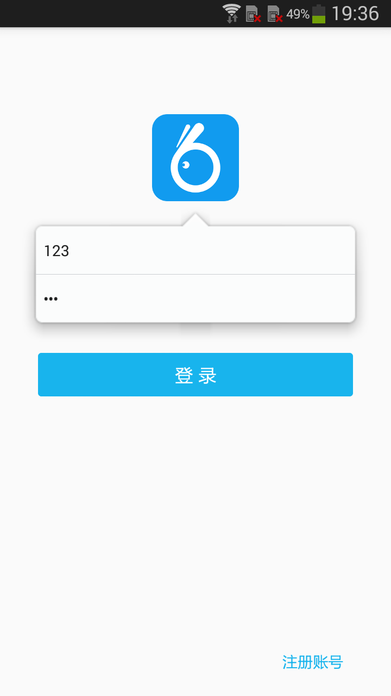
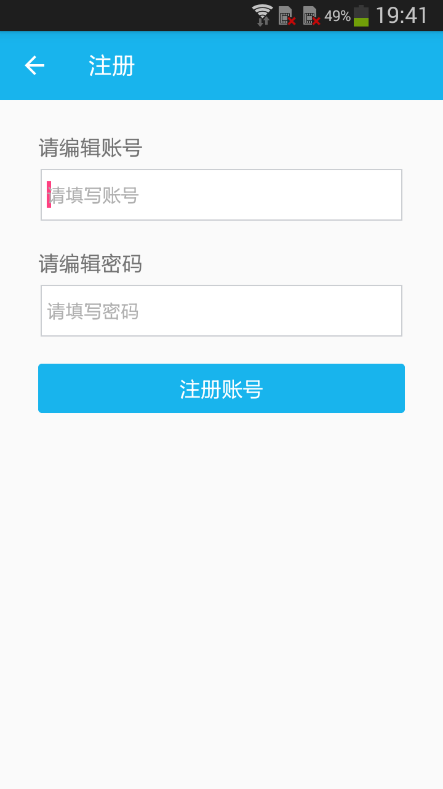
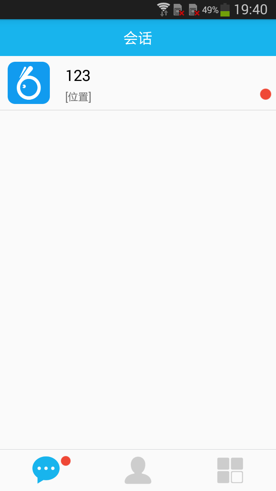
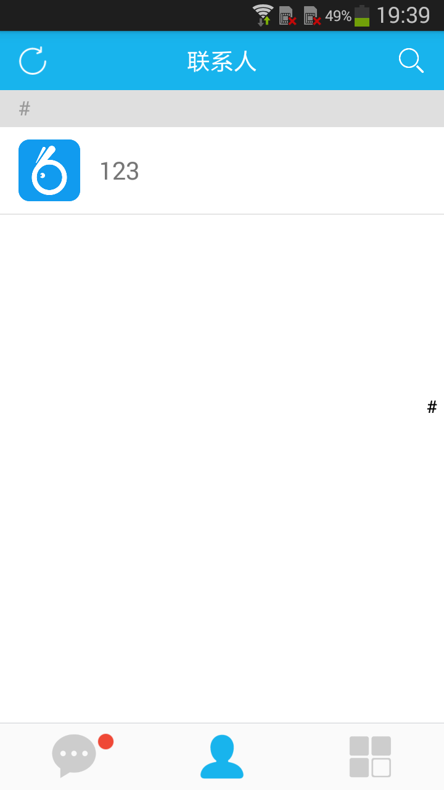
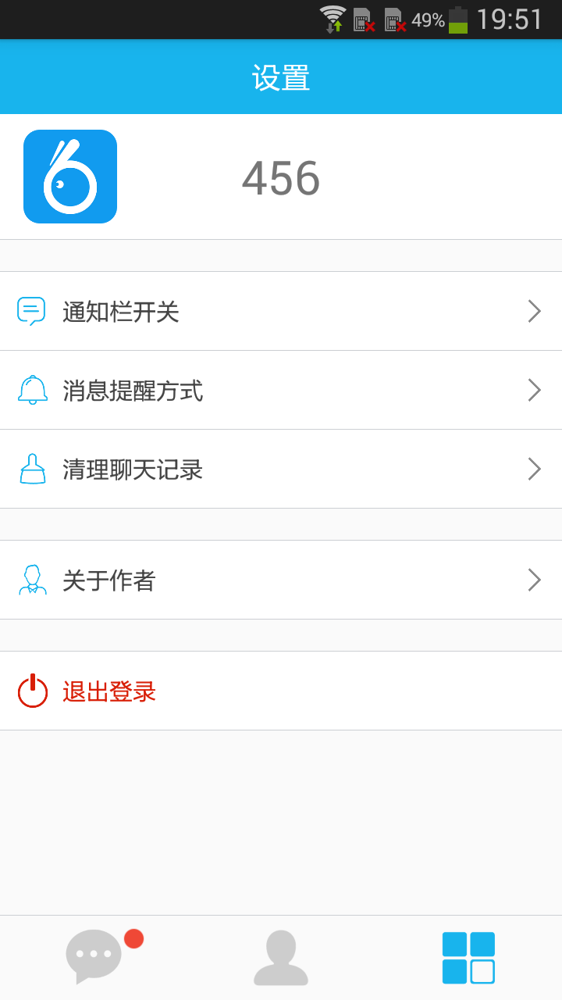
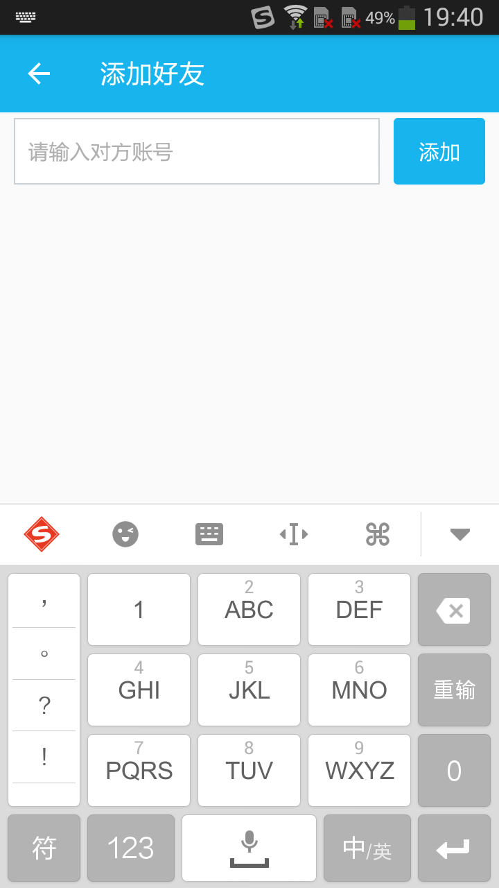
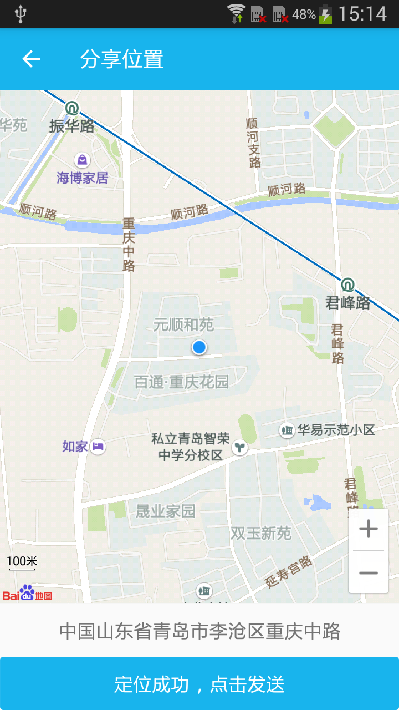
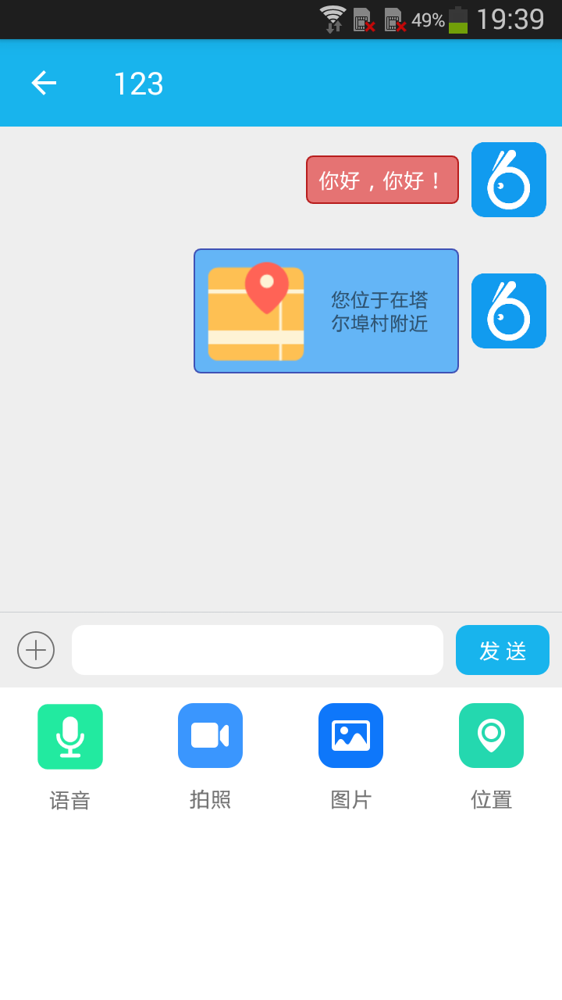

项目说明
------

* 主题：一个简单的即时通信客户端，由MySQL数据库 + Openfire服务器 + Android客户端 ( Smack 4.19 ) 组成
* 功能：注册账号、登录和退出系统、获取好友列表、添加和删除好友、收发文本消息、分享位置（基于百度地图SDK）
* 说明：本源码来自董相志老师所著的《Java 网络编程案例》，书中第15章由我所写，并配有微课视频，特将代码开源至此
* 支持：由于本人能力有限，如果有疑问或错误，可以提交问题或发邮件联系我。如果觉得还不错，您的 Star 是对我最大的鼓舞 O(∩_∩)O...

Project Description
-------
* Theme：A simple Android application to show the weather。
* Technology：V5 interface with heweather，Rxjava + Rxbus + Retrofit，ViewPager + Fragment + RecyclerView
* Support：If you have a problem or find an application error, you can submit a question here or contact me by mail. If you think this application is good, I hope you will give a "Star" to the project.
* Not Done：From the screenshot you can see, because I am not good at drawing icon, so did not add too many weather icons, hope to use PS tools friends can help me draw a set of icons; in addition, the application may be some matching problems in high version of the Android system.

Contact Information
-------
* Author: 郭峰
* Email: iamguofeng@163.com 
* CSDN: http://blog.csdn.net/plain_maple

Application Screenshot
-------
| Main Page 1                    | Main Page 2                       | Side Page                        |Author Page                       |
|:------------------------------:|:---------------------------------:|:--------------------------------:|:--------------------------------:|
|          |             |            |            |

| Main Page 1                    | Main Page 2                       | Side Page                        |Author Page                       |
|:------------------------------:|:---------------------------------:|:--------------------------------:|:--------------------------------:|
|          |             |            |            |

